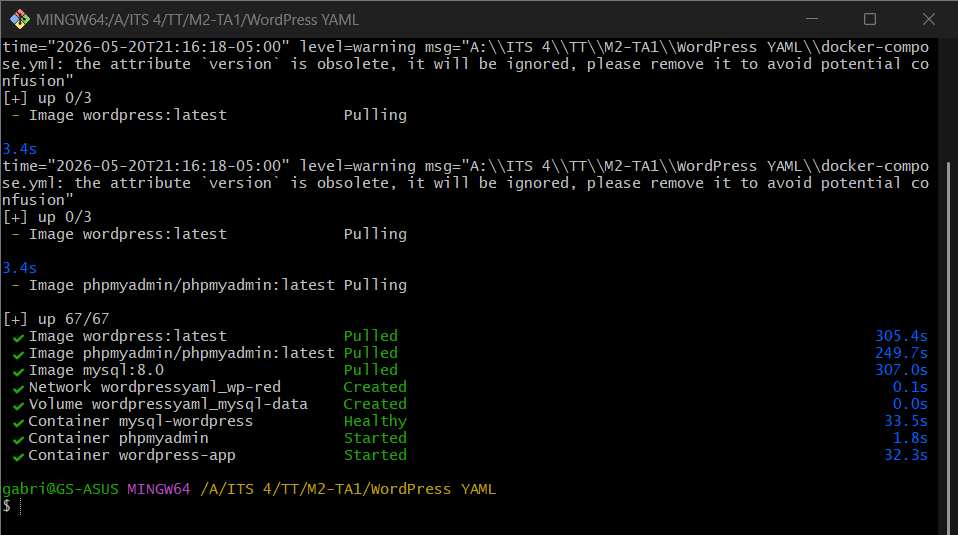
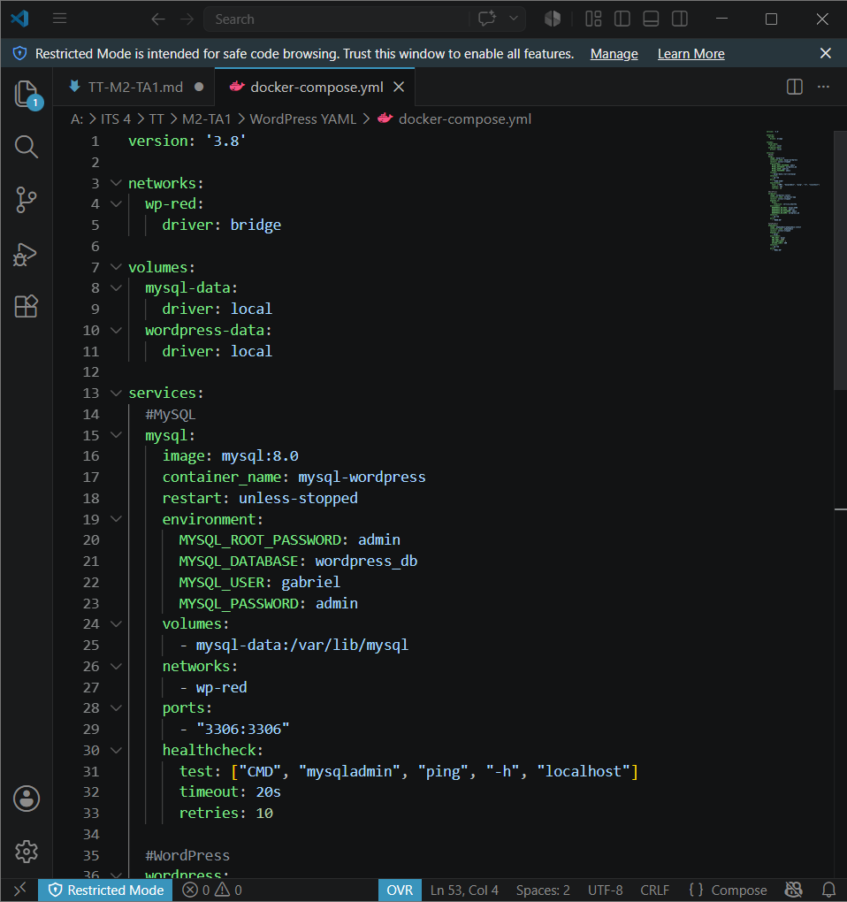
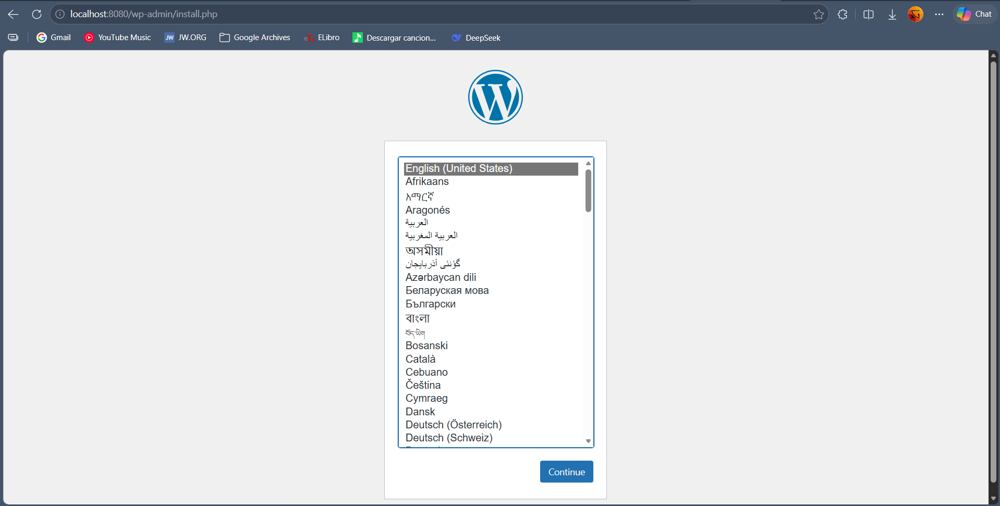
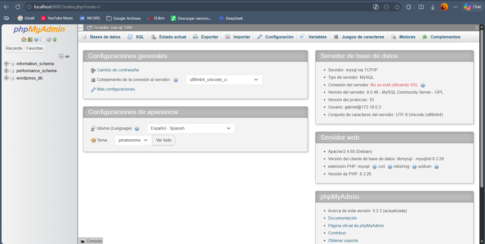

# Práctica de Docker Compose

Estudiante: Gabriel Sotomayor

Fecha: 20/5/2026

Duración: 1h

## Fundamentos

### DOCKER COMPOSE

Según la  documentación oficial, Docker Compose es una herramienta diseñada para definir y ejecutar aplicaciones Docker de múltiples contenedores. Permite describir toda la infraestructura de una aplicación, es decir, servicios, redes y volúmenes, en un único archivo YAML, llamado típicamente docker-compose.yml. La ventaja principal es que permite transformar la gestión de múltiples contenedores en un proceso declarativo. En lugar de ejecutar numerosos comandos docker run con múltiples flags y configuraciones, se definee el "estado deseado" de la infraestructura. Así se puede automatizar la creación de un sistema. La diferencia entre Dockerfile y Docker Compose, es que Dockerfile construye imágenes para un servicio. En canbio Docker Compose define y ejecuta contenedores y los volumenes y redes que necesitan para funcionar.

### ARQUITECTURA DE UN COMPOSE

Un archivo docker-compose.yml estándar se organiza en tres secciones principales:

- Versión (version): Define la version del archivo compose. Es opcional pues Docker Compose puede inferir en la versión automaticamente.

- Servicios (services): Básicamente, representan los contenedores, los cuales se hacen a partir de imagenes. Estos pueden ser servicios de BD como postgres o mysql, o web como WordPress. Por lo general, para los servicios se deben definir:

1. Imagen docker
2. Nombre del contenedor
3. Variables de entorno
4. Puertos
5. Volúmenes asociados
6. Red a la que se conectará

- Volúmenes (volumes): Son los volúmenes que proporcionan persistencia de datos a los servicios de BD. Son opcionales si no hay nigún servicio que requiera un volúmen.

- Redes (networks): Son las redes de docker a la que los servicios se conectaran internamente. Si no se define en el yml, docker crea una automáticmante. Pero siempre es mejor definirla uno mismo.

### COMANDOS COMPOSE

- docker compose up -d: Levanta todos los servicios en segundo plano.
- docker compose down: Detiene y elimina todos los contenedores.
- docker compose down -v: También elimina los volúmenes (borra datos).
- docker compose ps: Muestra el estado de los servicios.
- docker compose logs -f: Sigue los logs en tiempo real.
- docker compose restart: Reinicia servicios específicos.

### Bibliografía
- Docker. (2026, febrero 22). *What is Docker Compose?* Docker Documentation. https://docs.docker.com/get-started/docker-concepts/the-basics/what-is-docker-compose

- Docker. (2026, mayo 13). *Docker Compose*. Docker Documentation. https://docs.docker.com/compose

- The Compose Specification. (2019, diciembre 10). *Compose specification*. GitHub. https://github.com/compose-spec/compose-spec/blob/main/spec.md

## Conocimientos previos

Necesario tener claro los siguientes temas:

* Manejo de GitBash
* Comandos Docker
* Comandos red de Docker
* Nomenclatura YAML
* Variables Wordpress
* Variables MySQL

## Objetivos

* Dominar la escritura de archivos yaml para docker-compose.
* Crear sistemas completos por medio de docker-compose.

## Equipo necesario:

* Computadora.
* Terminal de GitBash.
* Docker Desktop instalado.

## Material de apoyo

* Guía de comandos básicos de network Docker.
* Guía de nomenclatura YAML.

## Procedimiento

1. Crear un archivo compose con:
    - Tres servicios: wordpress, mysql, phpmyadmin.
    - Una red docker.
    - Un volumen para mysql.

2. Ejecutar el archivo .yml y generar el sistema.

3. Commprobrar el funcionamiento con los logs e ingresando en las direcciones localhost para phpmyadmin y WordPress.

## Resultados

Los contenedores mysql (imagen mysql:8.0),  wordpress, y phpmyadmin (imagen phpmyadmin/phpmyadmin:latest) fueron creados y ejecutados exitosamente mediante Docker Compose. El contenedor de MySQL se configuró con los puertos 3306:3306, mientras que phpMyAdmin se configuró con el puerto 8081:80 del host. El puerto 8080 fue configurado para WordPress.

Imágen de la terminal de GitBash:

Imágen del código yml ejecutado:

Imágen de Wordpress funcionando:

Imágen de PhpMyAdmin funcionando:

